<p align="center">
  
</p>

<p align="center">
  <a href="#quick-start"><b>Quick start</b></a>
  &nbsp;·&nbsp;
  <a href="#how-it-works"><b>How it works</b></a>
  &nbsp;·&nbsp;
  <a href="#what-you-get"><b>What you get</b></a>
  &nbsp;·&nbsp;
  <a href="#built-for-ai-agents"><b>AI agents</b></a>
  &nbsp;·&nbsp;
  <a href="docs/index.md"><b>Docs</b></a>
</p>

<p align="center">
  <a href="go.mod"></a>
  <a href="LICENSE"></a>
  
  
</p>

**Scenery is a runtime and toolchain for Go backends.** Describe *what your
app is* (its APIs, background jobs, data and auth) in small `.scn` files, and
write *what it does* in plain Go. Scenery generates the glue, runs the whole
app and its frontends with one command, and shows you, and your AI agents,
exactly what is happening inside.

It is open source and runs on your own machine. It is not a hosted service,
and not an AI app generator: it runs *your* code.

## Why Scenery?

Shipping a feature usually means shipping its plumbing too. Scenery turns the
plumbing into a declaration, so your time goes into the product.

| | Without Scenery | With Scenery |
|:-:|---|---|
| 🔌 | Hand-written routers, request parsing and JSON codecs | Declare an operation and its route; the handler receives typed input |
| 🧬 | Frontend types drift away from the backend API | A typed TypeScript client is generated from the same declaration |
| 🧰 | Scripts to start Postgres, workers and frontend servers | `scenery up` starts and supervises all of it |
| 🔍 | Logs in one tool, traces in another, if anywhere | Logs, traces and metrics in one dev console and one CLI |
| 🤖 | AI agents guess how the project is wired | Agents read the same app graph as JSON |

## How it works

<p align="center">
  
</p>

Here is the whole loop for a tiny `echo` endpoint, adapted from the
[`testdata/apps/basic`](testdata/apps/basic) app.

**1️⃣ Declare what exists.**
[`service/package.scn`](testdata/apps/basic/service/package.scn) names the
operation, its input and result records, and the HTTP route that calls it:

```hcl
operation "echo" {
  service = service.service
  input   = record.echo_input

  handler {
    method = "Echo"
  }

  result "ok" {
    type = record.echo_result
  }
}

binding "echo_http" {
  operation = operation.echo
  protocol  = "http"

  # ...plus execution, auth policy and JSON mapping (see the full file)

  http {
    method = "POST"
    path   = "/echo"
  }
}
```

**2️⃣ Write what it does.** Scenery turns the declaration into a typed Go
package, `scenerycontract`. You implement the constructor and handler it asks
for:

```go
package service

import (
	"context"

	contract "example.com/basicapp/service/scenerycontract" // generated
)

type Service struct{}

func NewService(context.Context, contract.ServiceConstructorInput) (*Service, error) {
	return &Service{}, nil
}

func (*Service) Echo(_ context.Context, in contract.EchoInput) (contract.EchoOutcome, error) {
	return contract.EchoOk{Value: contract.EchoResult{Message: "echo:" + in.Message}}, nil
}
```

`scenery up`, `build` and `test` keep the generated package current. After a
fresh checkout, run `scenery generate --target contracts` once so your editor
and plain `go` commands can see it.

**3️⃣ Run it.** `scenery up` builds the app, starts it and keeps watching your
files:

```console
$ scenery up
  …
  ✔ Generating boilerplate code (54ms)
  ✔ Analyzing service topology (0ms)
  ✔ Starting Victoria observability stack (129ms)
  ✔ Compiling application source code (245ms)
  …

  scenery development server running

  ➜ API:           http://localhost:4624/api/
  ➜ Dashboard:     http://localhost:4624/console/
  ➜ Frontend root: http://localhost:4624/
```

```console
$ curl --json '{"message":"hi"}' http://localhost:4624/api/echo
{"message":"echo:hi"}
```

Your port will differ; `scenery ps` lists the URLs of every running app.

## What you get

<table>
  <tr>
    <td width="33%" valign="top">
      <b>⚡ Typed HTTP APIs</b><br>
      Declare operations, records and routes once. Handlers receive validated,
      typed input and return typed results.
    </td>
    <td width="33%" valign="top">
      <b>⏱️ Durable jobs and schedules</b><br>
      Retries, timeouts, leases and idempotency keys sit next to the
      operation, together with schedules and events.
    </td>
    <td width="33%" valign="top">
      <b>🐘 Managed PostgreSQL</b><br>
      A local database in Docker, checksum-bound SQL migrations
      (<code>scenery db migrate</code>), seeds and portable snapshots.
    </td>
  </tr>
  <tr>
    <td valign="top">
      <b>🔐 Auth built in</b><br>
      Email sign-up and login, sessions, organizations and invites. Every route
      declares whether it is public or protected.
    </td>
    <td valign="top">
      <b>📦 Object storage</b><br>
      Store files from Go with <code>scenery.sh/storage</code>: tenant scoping,
      conditional writes and inspection from the CLI.
    </td>
    <td valign="top">
      <b>🧩 Generated TypeScript client</b><br>
      <code>scenery generate</code> writes a typed fetch client that matches
      your API, with optional generated React pages. Your product UI stays yours.
    </td>
  </tr>
  <tr>
    <td valign="top">
      <b>🔭 Logs, traces and metrics</b><br>
      Requests, database queries and HTTP calls are traced automatically.
      Explore them in the dev console or query them from the CLI.
    </td>
    <td valign="top">
      <b>🔁 Live rebuilds</b><br>
      One process per service. An edit rebuilds and replaces only the services
      it touched, while the rest keep serving.
    </td>
    <td valign="top">
      <b>🤖 Ready for AI agents</b><br>
      Machine-readable JSON from the CLI, stable <code>SCN</code> diagnostic
      codes and an installable agent skill.
    </td>
  </tr>
</table>

**Also included:** an isolated runtime and data for every Git worktree, branded
dev domains, declared AI assistants over MCP, app-local code tasks, and beta
deployment to your own server.

## One command, the whole app

<p align="center">
  
</p>

| Command | What it does |
|---|---|
| `scenery up` | Build, start and watch the app with its database, frontends and dev console |
| `scenery ps` | List running apps and their URLs |
| `scenery logs --follow` | Stream the app's logs |
| `scenery console` | Open the dev console |
| `scenery check` | Validate declarations and generated Go contracts |
| `scenery generate` | Regenerate TypeScript clients and other configured outputs |
| `scenery down` | Stop the app |
| `scenery doctor` | Check that your machine and app are ready |

## Built for AI agents

Agents see what you see. The CLI answers in JSON (`-o json`, or `-o jsonl` for
streams) with exact revisions, producer identity and stable `SCNxxxx`
diagnostic codes, so an agent can find an endpoint, check a change and debug a
failure without guessing how the project is wired.

| Your agent wants to... | It runs |
|---|---|
| understand the app | `scenery inspect app -o json` |
| find an endpoint | `scenery inspect routes -o json` |
| check a change | `scenery check -o json` |
| read what just happened | `scenery logs -o jsonl --limit 200` |
| run the checks that matter | `scenery validate changed --base main -o json` |

For the `echo` app above, `scenery inspect routes -o json` returns (abridged):

```json
{
  "kind": "scenery.cli",
  "ok": true,
  "data": {
    "kind": "scenery.inspect.routes",
    "routes": [
      {
        "id": "service.Echo",
        "file": "service/package.scn",
        "access": "public",
        "path": "/echo",
        "methods": ["POST"]
      }
    ]
  },
  "diagnostics": []
}
```

Teach your agent the workflow with the installable [skill](SKILL.md):

```sh
npx skills add https://github.com/scenery-sh/scenery
```

You do not need an AI agent to use Scenery. Everything works just as well by
hand.

## Quick start

> [!IMPORTANT]
> Scenery is under active development. Its app format and CLI evolve together,
> so upgrades can require changes to your app. Deployment tooling is in beta,
> and there are no prebuilt releases yet: install from source.

You need **Go 1.27+**. Apps that use managed PostgreSQL also need **Docker**.

```sh
git clone https://github.com/scenery-sh/scenery.git
cd scenery
go install ./cmd/scenery   # install the CLI
scenery doctor             # check your machine
```

Make sure your Go bin directory is on your `PATH`. Then pick a path:

- 🧪 **Explore an example.** The [webhook inbox](examples/webhook-inbox/README.md)
  accepts an event, processes it in a background job, stores the result and
  serves it through an authenticated API.
- 🛠️ **Build your own app.** Follow the
  [app development cookbook](docs/app-development-cookbook.md). Pin
  `scenery.sh` in your app's `go.mod`, then run `scenery framework use -o json`
  to prepare the matching CLI.
- ⬆️ **Upgrade safely.** Installing a new Scenery never migrates your app or
  its data. When an update changes only retained metadata, preview the explicit
  [same-root upgrade](docs/runbooks/worktree-state-upgrade.md) with
  `scenery worktree upgrade -o json`.

## Learn more

| Read | For |
|---|---|
| 📚 [Documentation index](docs/index.md) | Everything, organized |
| 🍳 [App development cookbook](docs/app-development-cookbook.md) | Recipes for APIs, jobs, data, auth, storage and frontends |
| 📐 [Scenery specification](docs/spec/SPEC.md) | The `.scn` language and application contract |
| 🧾 [CLI and runtime reference](docs/local-contract.md) | Exact commands, JSON output and artifacts |
| 🤖 [Agent guide](docs/agent-guide.md) | Agent workflows and client-app integration |
| 🏗️ [Architecture](ARCHITECTURE.md) | How Scenery itself is organized |
| 🤝 [Contributing](CONTRIBUTING.md) | Working on Scenery |

Report vulnerabilities privately using the [security policy](SECURITY.md).
Scenery is licensed under [Apache 2.0](LICENSE).

<p align="center">
  
</p>
